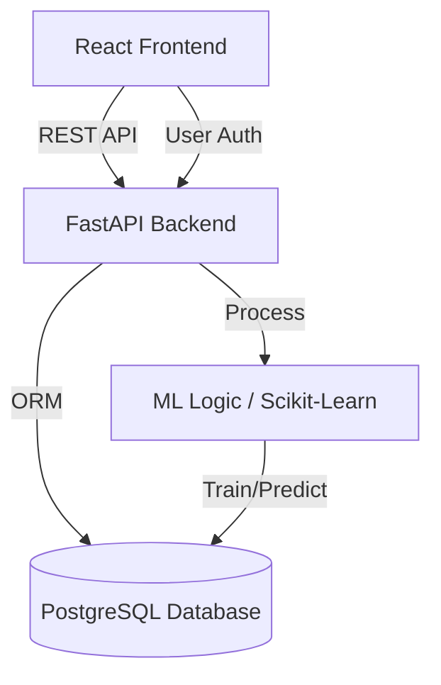

# Revenue Operations Analytics Platform

[](https://react.dev/)
[](https://fastapi.tiangolo.com/)
[](https://www.python.org/)
[](https://www.typescriptlang.org/)
[](LICENSE)

A powerful, full-stack analytics platform built to empower revenue operations teams. This application ingests raw sales data, processes it through machine learning models, and presents actionable insights via a modern, interactive dashboard. It provides real-time tracking of critical metrics like MRR, ARPU, and Churn Risk to drive data-backed decision-making.

---

## 🏗 Architecture

The platform follows a clean, decoupled architecture separating the presentation layer from the business logic and data processing.



---

## 🚀 Features

### 📊 Interactive Dashboard
- **Key Metrics**: Real-time display of MRR (Monthly Recurring Revenue), ARPU (Average Revenue Per User), and Active Customer counts.
- **Trend Analysis**: Sparklines and charts visualizing revenue growth and customer acquisition over time.
- **Category Split**: Breakdown of revenue by product category.

### 🤖 Advanced Intelligence
- **Churn Prediction**: utilizes unsupervised learning (K-Means Clustering) to categorize customers into `High`, `Medium`, or `Low` churn risk based on their transaction recency and frequency.
- **Revenue Forecasting**: Time-series forecasting models to predict future revenue trends.

### 👥 Customer Management
- **Detailed Profiles**: View complete transaction history and calculated lifetime value for each customer.
- **Risk Indicators**: Visual "Traffic Light" system (Red/Yellow/Green) indicating customer health.

### 📂 Data & Security
- **CSV Upload**: Bulk upload sales data seamlessly.
- **Secure Auth**: JWT-based authentication for secure access to the platform.
- **Data Validation**: Robust backend validation ensures data integrity upon ingest.

---

## 🛠 Tech Stack

| Area | Technology | Usage |
|------|------------|-------|
| **Frontend** | React 18, TypeScript | Core application logic |
| **UI Framework** | Material UI (MUI) | Component library & responsive design |
| **Visualization** | Recharts | Interactive charts and graphs |
| **Backend** | FastAPI | High-performance API framework |
| **Language** | Python 3.9+ | Backend logic and ML modeling |
| **Database** | PostgreSQL + SQLModel | Data persistence and ORM |
| **ML / AI** | Scikit-Learn, Pandas | Data processing, clustering, and regression |
| **Tooling** | Vite, ESLint | Build tool and code quality |

---

## ⚡ Getting Started

Follow these steps to set up the project locally.

### Prerequisites
- **Node.js** (v18 or higher)
- **Python** (v3.9 or higher)
- **Git**

### 1. Clone the Repository
```bash
git clone https://github.com/Sahaj2310/Revenue-Operations-Analytics-Platform.git
cd Revenue-Operations-Analytics-Platform
```

### 2. Backend Setup
Set up the Python environment and start the API.

```bash
cd backend

# Create Virtual Environment
python -m venv venv

# Activate Environment
# Windows:
.\venv\Scripts\activate
# Mac/Linux:
source venv/bin/activate

# Install Dependencies
pip install -r requirements.txt

# Start Server
uvicorn main:app --reload
```
The backend includes a **Swagger UI** for testing endpoints at `http://localhost:8000/docs`.

### 3. Frontend Setup
In a new terminal, set up the React client.

```bash
cd frontend

# Install Dependencies
npm install

# Start Development Server
npm run dev
```
The application will launch at `http://localhost:5173`.

---

## � API Reference

Here are the primary endpoints available in the backend:

| Method | Endpoint | Description |
|--------|----------|-------------|
| `POST` | `/token` | Authenticate user and get JWT token |
| `POST` | `/register` | Register a new user |
| `GET` | `/stats` | Get high-level dashboard statistics |
| `GET` | `/analytics/advanced` | Get detailed analytics (MRR, Churn, etc.) |
| `GET` | `/customers` | List all customers with risk scores |
| `GET` | `/customers/{name}` | Get specific details for a customer |
| `GET` | `/forecast` | Get revenue forecast data |
| `POST` | `/upload` | Upload CSV sales data |
| `DELETE` | `/data` | Clear all stored data |

---

## 📂 Project Structure

```
Revenue-Operations-Analytics-Platform/
├── backend/                # FastAPI Application
│   ├── main.py            # App entry point & endpoints
│   ├── ml_logic.py        # Machine Learning models
│   ├── models.py          # Database schemas
│   ├── auth.py            # Authentication logic
│   └── requirements.txt   # Python dependencies
├── frontend/               # React Application
│   ├── src/
│   │   ├── components/    # Reusable UI components
│   │   ├── pages/         # Application views
│   │   ├── context/       # State management
│   │   └── theme.ts       # UI Theme configuration
│   └── package.json       # Node.js dependencies
└── README.md               # Project Documentation
```

## 🤝 Contributing

Contributions are welcome! Please fork the repository and create a pull request with your changes. Ensure that you have updated the documentation and tests where necessary.

## 📄 License

This project is open-source and available under the [MIT License](LICENSE).
