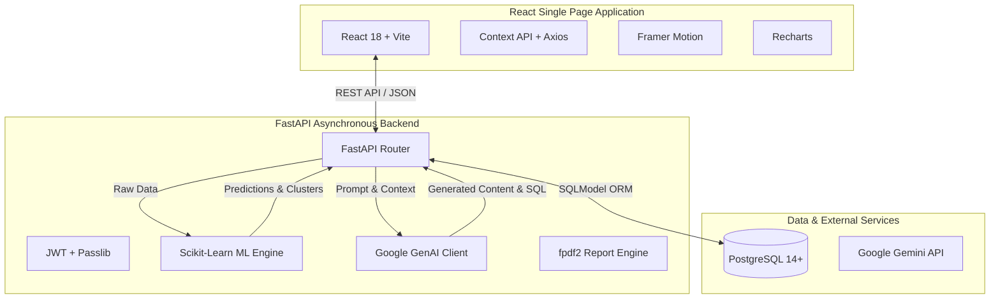

# 🚀 Revenue Operations Analytics Platform (RevOps)


> An enterprise-grade **Revenue Operations Intelligence Platform** designed to empower sales, customer success, and finance teams. By converging Machine Learning, Generative AI, and a high-performance modern web architecture, RevOps transforms raw transaction data into actionable, predictive intelligence.

---

## 📸 Platform Previews

The platform features a highly polished, premium dark-mode aesthetic built with Material UI, Framer Motion, and Stitch design assets.

| Executive Dashboard | Advanced Analytics | AI Customer Hub |
|:---:|:---:|:---:|
| *Real-time KPIs, Revenue Sparklines, and predictive metrics* | *In-depth categorization, Churn Risk Scatter Plots* | *Gemini-powered outreach emails and NL2SQL Copilot* |

---

## ✨ Comprehensive Capabilities

### 🧠 Advanced Artificial Intelligence & Machine Learning
- **Predictive Churn Analysis:** Utilizes Scikit-Learn's K-Means clustering algorithm on dynamic RFM (Recency, Frequency, Monetary) data to automatically segment customers into High, Medium, and Low risk categories.
- **AI Sales Pitch & Retention Generator:** Context-aware email drafting powered by **Google Gemini (gemini-2.5-flash)**. Instantly generates personalized outreach based on a user's historical transaction data, churn risk, and overall relationship value.
- **RevOps Copilot (NL2SQL):** A conversational side-panel assistant that translates plain English queries (e.g., *"Show me the top 3 customers by revenue this month"*) into secure, parameterized SQL queries, executes them against the PostgreSQL database, and visualizes the results dynamically.
- **Automated Executive Summaries:** Generates concise, highly readable 3-sentence executive summaries using Gemini 1.5 Flash, directly embedded into downloadable PDF reports.
- **Algorithmic Revenue Forecasting:** Leverages degree-2 polynomial regression to project revenue trajectories 3 to 6 months into the future based on historical trends.
- **High Reliability AI Architecture:** Built-in multi-attempt retry logic with exponential backoff (using Tenacity). Automatically falls back to secondary models (`gemini-2.0-flash` or `gemini-flash-latest`) during API rate limits or transient outages.

### 📊 Real-Time Analytics & Data Visualization
- **Live KPI Dashboard:** Instant calculations of Monthly Recurring Revenue (MRR), Average Revenue Per User (ARPU), Active Customers, and Month-over-Month Growth Rates.
- **Interactive Data Visualization:** Powered by Recharts, offering dynamic sparklines for revenue trends, donut charts for product category splits, and XY scatter plots mapping Days-Since-Purchase vs. Revenue to visualize churn risk visually.
- **Data Portability:** One-click generation of beautifully formatted PDF Executive Reports (via fpdf2) complete with embedded charts, tabular data, and AI-authored summaries.
- **Seamless Data Ingestion:** Robust CSV bulk-upload processing pipeline that instantly validates, ingests, and recalculates all ML models and metrics upon upload.

### 🔐 Enterprise Security & Multi-Tenancy
- **Stateless JWT Authentication:** Secure login and registration flows using JSON Web Tokens (python-jose).
- **Argon2 Password Hashing:** State-of-the-art password security using Passlib and the Argon2 algorithm.
- **Strict Data Isolation:** Multi-tenant architecture ensures every metric, transaction, and customer profile is strictly scoped to the authenticated user ID at the database level.

---

## 🏗 Deep System Architecture

The application is built on a decoupled, asynchronous microservices architecture.


```mermaid
graph TD
    subgraph Frontend [React Single Page Application]
        UI[React 18 + Vite]
        State[Context API + Axios]
        Animations[Framer Motion]
        Charts[Recharts]
    end

    subgraph Backend [FastAPI Asynchronous Backend]
        API[FastAPI Router]
        Auth[JWT + Passlib]
        ML[Scikit-Learn ML Engine]
        GenAI[Google GenAI Client]
        PDF[fpdf2 Report Engine]
    end

    subgraph Infrastructure [Data & External Services]
        DB[(PostgreSQL 14+)]
        Gemini[Google Gemini API]
    end

    UI <-->|REST API / JSON| API
    API <-->|SQLModel ORM| DB
    API -->|Prompt & Context| GenAI
    GenAI -->|Generated Content & SQL| API
    API -->|Raw Data| ML
    ML -->|Predictions & Clusters| API
```

---

## 🛠 Technology Stack

### Backend Services
- **Framework:** FastAPI (0.100+) — High-performance asynchronous REST framework.
- **Database & ORM:** PostgreSQL 14+, SQLModel (0.0.16+) — Pydantic-driven database models.
- **Machine Learning:** Pandas (2.0+), Scikit-Learn (1.3+) — Data aggregation and modeling.
- **Generative AI:** `google-genai` (1.66+) — Official Google Gemini SDK.
- **Security:** `python-jose[cryptography]`, `passlib[argon2]` — Token and password management.
- **Utilities:** `fpdf2` (PDF generation), `tenacity` (retry logic), `python-multipart` (file uploads).

### Frontend Application
- **Core:** React 18, TypeScript (5.0+), Vite (5.0+) — Lightning fast build tools and strict typing.
- **Routing & State:** React Router DOM v7, React Context API.
- **UI Components & Styling:** Material UI (MUI v5), Emotion.
- **Animations:** Framer Motion (12+) — Staggered, fluid page transitions and micro-interactions.
- **Charting:** Recharts (2.10+) — Responsive SVG charts.

---

## 📂 Project Structure

```text
Revenue-Operations-Analytics-Platform/
│
├── backend/                       # Python / FastAPI Backend
│   ├── main.py                    # Application entry point & route definitions
│   ├── models.py                  # SQLModel schemas (User, RevenueData)
│   ├── auth.py                    # JWT generation, validation, & hashing
│   ├── database.py                # PostgreSQL connection pooling & session management
│   ├── ml_logic.py                # Churn risk (K-Means) & forecasting (Regression)
│   ├── ai_service.py              # Gemini API integration (NL2SQL, Exec Summary, Pitch)
│   ├── report_service.py          # fpdf2 PDF document generation logic
│   ├── test_gemini.py             # Sandbox script for verifying Gemini connectivity
│   ├── requirements.txt           # Python dependency manifests
│   └── .env                       # Environment configuration (ignored in git)
│
├── frontend/                      # React / TypeScript Frontend
│   ├── src/
│   │   ├── pages/                 # Top-level route components (Dashboard, Analytics, etc.)
│   │   ├── components/            # Reusable UI widgets
│   │   │   ├── AICopilot/         # Copilot Sidebar & Result components
│   │   │   ├── CustomerDrawer.tsx # Right-sliding customer detail & AI pitch UI
│   │   │   └── ...                # Charts, Tables, Navigation elements
│   │   ├── context/               # Global Authentication State Provider
│   │   ├── api.ts                 # Centralized Axios HTTP client
│   │   ├── types.ts               # Global TypeScript interfaces
│   │   └── theme.ts               # Custom MUI dark theme configuration
│   ├── package.json               # Node dependency manifest
│   └── vite.config.ts             # Vite build configuration
│
├── stitch_assets/                 # Downloaded Stitch UI design templates (via script)
├── download_stitch.py             # Script to fetch premium UI templates
└── sample_data.csv                # Example CSV for immediate testing
```

---

## ⚡ Setup & Installation Guide

### Prerequisites
- **Node.js** v18+
- **Python** 3.9+
- **PostgreSQL** 14+ (Local installation or cloud hosted, e.g., Supabase/Neon)
- **Google Gemini API Key** (Obtain free at [Google AI Studio](https://aistudio.google.com/app/apikey))

### 1. Clone the Repository
```bash
git clone https://github.com/Sahaj2310/Revenue-Operations-Analytics-Platform.git
cd Revenue-Operations-Analytics-Platform
```

### 2. Backend Initialization
```bash
cd backend
python -m venv venv

# Windows
.\venv\Scripts\activate
# macOS/Linux
source venv/bin/activate

pip install -r requirements.txt
```

Create a `.env` file in the `backend/` directory:
```env
# Database configuration
DATABASE_URL=postgresql://<username>:<password>@localhost:5432/revops_db

# Security & Authentication
SECRET_KEY=generate_a_secure_random_string_here
ALGORITHM=HS256
ACCESS_TOKEN_EXPIRE_MINUTES=60

# Google Gemini API
GEMINI_API_KEY=your_actual_api_key_here
```

Start the backend server:
```bash
uvicorn main:app --reload
```
*The backend API will be running at `http://localhost:8000` with interactive Swagger UI docs at `/docs`.*

### 3. Frontend Initialization
Open a new terminal window:
```bash
cd frontend
npm install
npm run dev
```
*The frontend application will be running at `http://localhost:5173`.*

---

## 🧪 Testing & Verification

To verify that your Gemini API key is configured correctly and the required models are accessible, run the built-in diagnostic script:

```bash
cd backend
# Ensure your virtual environment is active
python test_gemini.py
```
A successful test will output a greeting from the `gemini-2.5-flash` model.

---

## 📖 User Journey (How to Use)

1. **Onboarding:** Navigate to `http://localhost:5173`. Create a new account via the **Register** page.
2. **Data Ingestion:** Upon login, navigate to the **Dashboard**. Click **Upload CSV** and provide the included `sample_data.csv` (or your own data following the required schema).
3. **Intelligence Gathering:** Watch as the dashboard instantly populates with live KPIs, revenue forecasts, and churn risk visualizations based on the newly ingested data.
4. **AI Outreach:** Navigate to the **Customers** tab. Click on any customer row to open the details drawer. Click **Generate AI Pitch** to watch Gemini craft a personalized email tailored to that specific customer's risk profile.
5. **Conversational Analytics:** Open the **AI Copilot** (bottom right). Ask a question like *"Show me a bar chart of the top 5 customers by total revenue"*.
6. **Reporting:** Navigate to **Analytics** and click **Download Report (.pdf)** to generate a shareable executive document.

---

## 📑 Complete REST API Reference

All protected routes require an `Authorization: Bearer <token>` header.

### Authentication
- `POST /register` — Register a new user (requires email/password).
- `POST /token` — Authenticate and receive a JWT access token.

### Data & Metrics (Protected)
- `GET /stats` — Retrieve aggregated dashboard KPIs.
- `GET /analytics/advanced` — Retrieve deep analytics, optionally filtered by `time_range`.
- `GET /forecast` — Generate a 3-month ML revenue prediction.
- `GET /customers` — List all customers with calculated RFM scores and Churn Risk.
- `GET /customers/{name}` — Retrieve specific transaction history for a single customer.

### AI & Operations (Protected)
- `POST /customers/{name}/generate-pitch` — Generate a Gemini-powered sales email.
- `POST /ai/copilot` — Process NL2SQL queries and return executable JSON results.
- `GET /reports/executive-summary` — Generate and download the PDF report.

### Ingestion
- `POST /upload` — Multipart form upload for CSV data ingestion.
- `DELETE /data` — Wipe all data associated with the authenticated user.

---

## 📊 CSV Data Schema Requirements

For custom data uploads, ensure your CSV file strictly adheres to the following format:

| Column Header   | Data Type | Description                              | Example          |
|-----------------|-----------|------------------------------------------|------------------|
| `date`          | YYYY-MM-DD| Transaction date                         | `2024-03-15`     |
| `amount`        | Float     | Transaction value in USD                 | `1500.00`        |
| `customer_name` | String    | Name of the purchasing entity            | `Acme Corp`      |
| `category`      | String    | Product or service category              | `Subscription`   |

---

## 🤝 Contributing

We welcome contributions to the RevOps Analytics Platform! To contribute:
1. Fork the repository.
2. Create a feature branch: `git checkout -b feature/your-new-feature`
3. Commit your changes with clear, descriptive messages.
4. Push to the branch and open a Pull Request.

## 📄 License

This project is licensed under the [MIT License](LICENSE).
